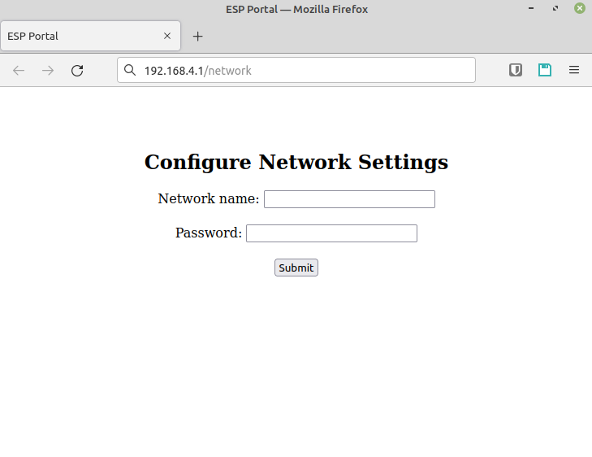
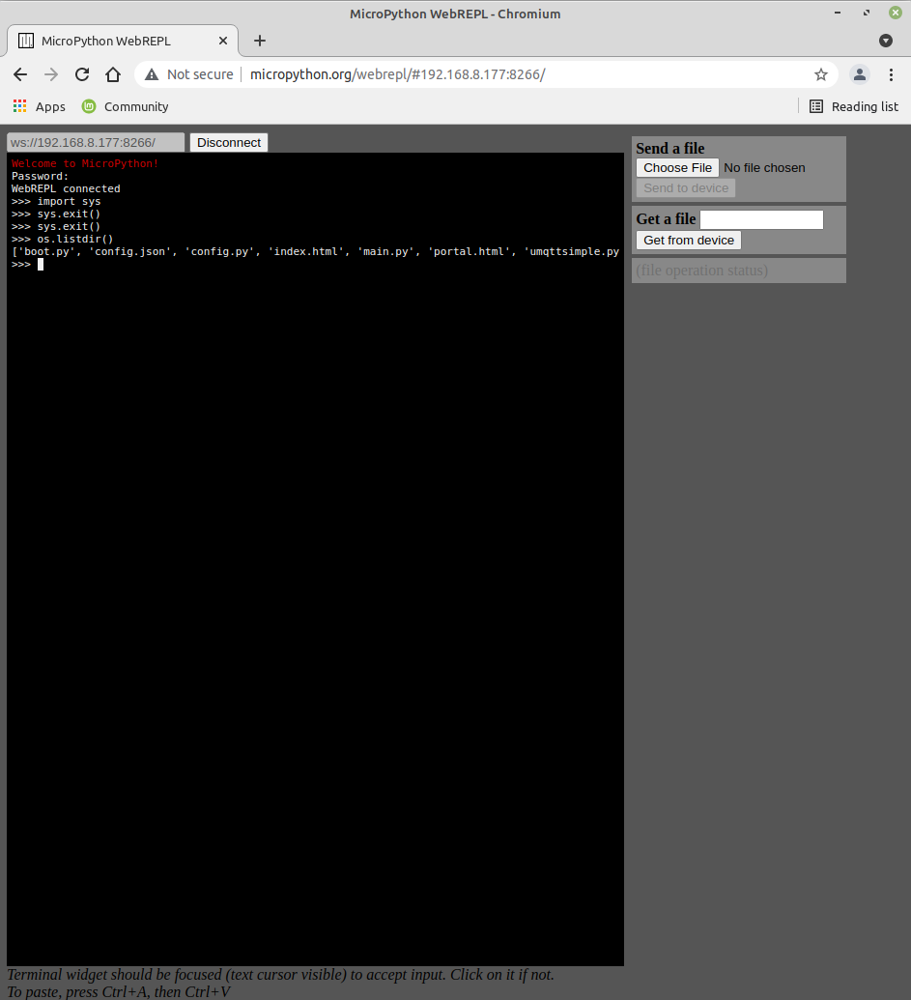

## Config file (config.py)

    WIFI_SSID = 'YOUR_WIFI_SSID_NAME'
    WIFI_PASSWD = 'YOUR_WIFI_PASSWORD'
    MQTT_BROKER = 'YOUR_MQTT_BROKER_IP_ADRESS'
    MQTT_USER = 'MQTT_USER_FOR_CONNECTION'
    MQTT_PASSWD = 'MQTT_PASS_FOR_CONNECTION'

## Captive portal

## Web editor
