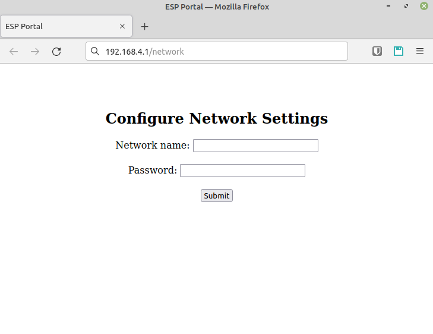
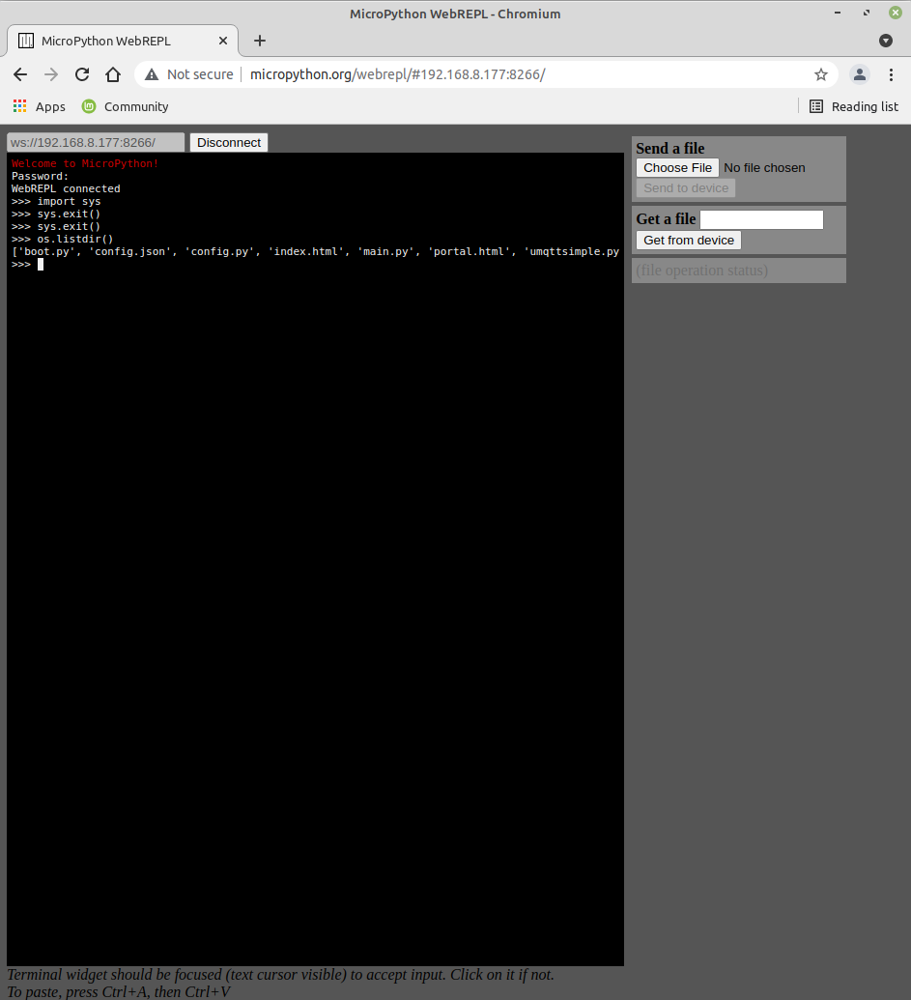

# Esp8266 MQTT Client based on MicroPython

<table border="0">
  <tr>
    <td>:bulb:</td>
    <td>For a convinient interactive documentation please visit: <a href="https://matbgn.github.io/mqtt_upython/">https://matbgn.github.io/mqtt_upython/</a></td>
  </tr>
</table>

## Config file (config.py)

    WIFI_SSID = 'YOUR_WIFI_SSID_NAME'
    WIFI_PASSWD = 'YOUR_WIFI_PASSWORD'
    MQTT_BROKER = 'YOUR_MQTT_BROKER_IP_ADRESS'
    MQTT_USER = 'MQTT_USER_FOR_CONNECTION'
    MQTT_PASSWD = 'MQTT_PASS_FOR_CONNECTION'

## Captive portal

## Web editor
